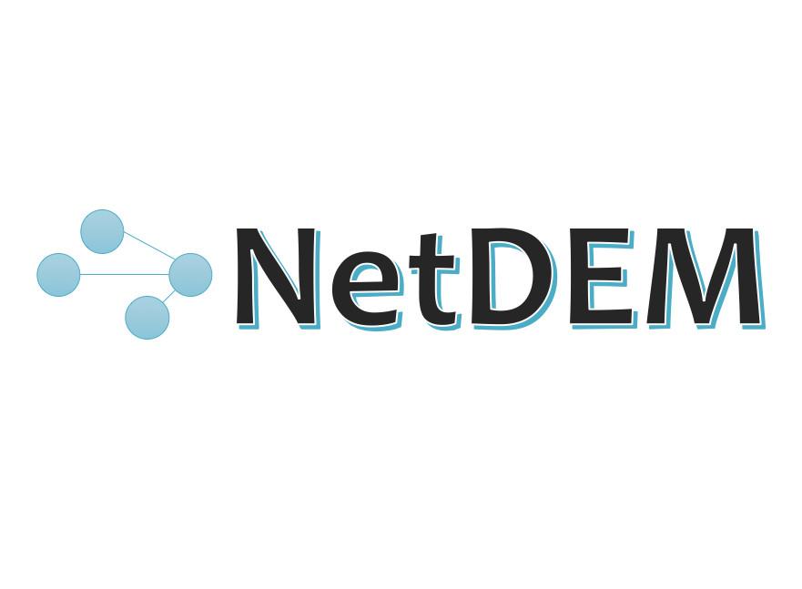
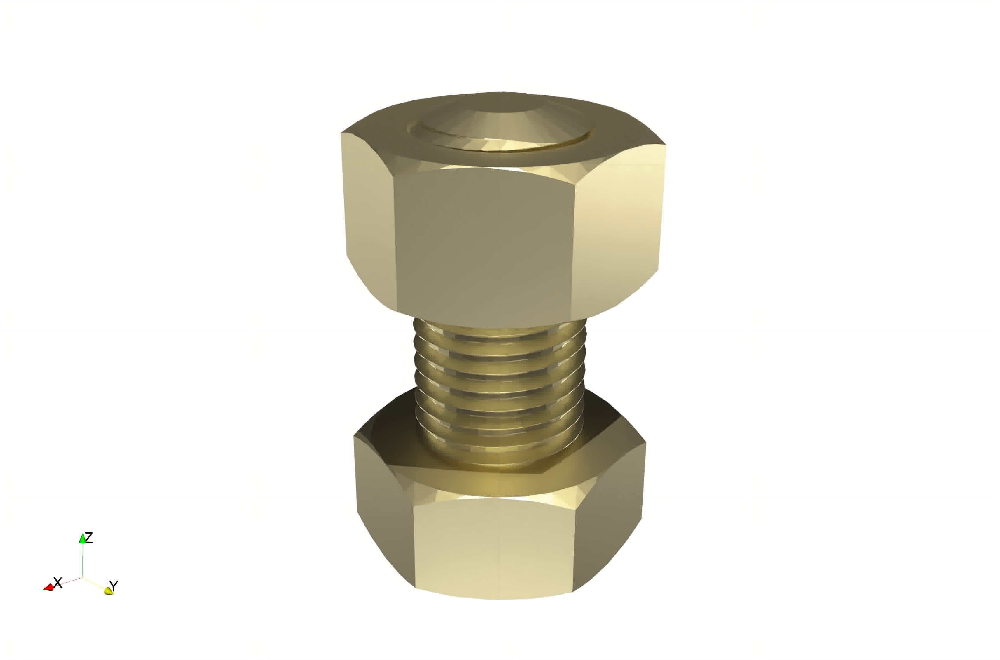
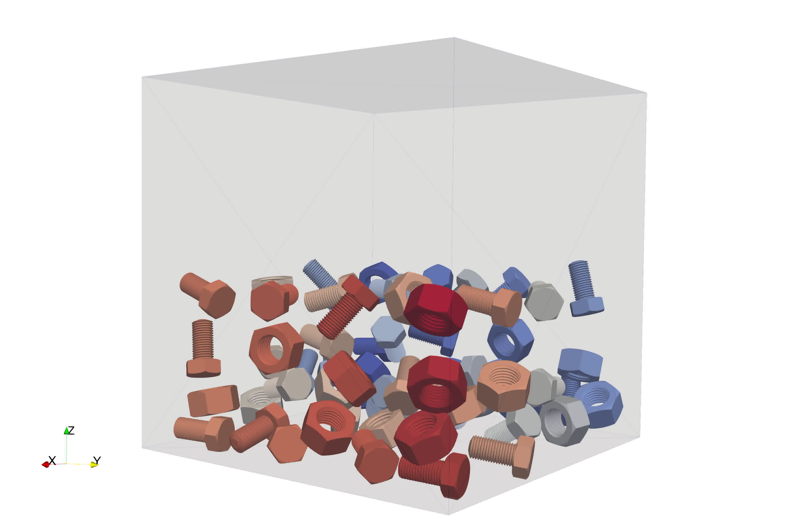

<!-- Indicators -->
<ol class="carousel-indicators">
<li data-target="#myCarousel" data-slide-to="0" class="active"></li>
<li data-target="#myCarousel" data-slide-to="1"></li>
<li data-target="#myCarousel" data-slide-to="2"></li>
<li data-target="#myCarousel" data-slide-to="3"></li>
<li data-target="#myCarousel" data-slide-to="4"></li>
</ol>

<!-- Wrapper for slides -->

<!-- Left and right controls -->
<a class="left carousel-control" href="#myCarousel" data-slide="prev">

Previous
</a>
<a class="right carousel-control" href="#myCarousel" data-slide="next">

Next
</a>

NetDEM is a neural network enabled C++ library for discrete element methods.

## Features

It is currently capable of performing basic and general DEM simulations, with following features:

- Sphere and triangle facets contact solver
- GJK contact solver for convex particles
- SDF contact solver for arbitrary (convex and concave) particles
- Hybrid OpenMP and MPI parallel computing
- Integrated [mlpack](https://www.mlpack.org/) machine learning environment

The supported particle shapes include sphere, cylinder, poly-super-ellipsoid, poly-super-quadrics, spherical harmonics, triangle mesh, level set, etc.

## News

Date         | Message
------------ | -----------------------------------------------------------------
Dec 01, 2021 | Added pybind11 environment and python examples, exposed most APIs to python.
Sep 10, 2021 | Poly-super-ellipsoid, poly-super-quadric, spherical harmonics, level set, polyhedron and etc.
Aug 15, 2021 | Generlized two types of contact solvers, namely GJK and SDF.
Mar 15, 2021 | Integrated the [mlpack](https://github.com/mlpack/mlpack.git) as the machine learning environment.

<!-- ## Latest Release -->

<!-- [New features](https://github.com/net-dem/netdem/blob/v4.3/CHANGELOG) -->

<!-- [<button type="button" class="btn btn-success">
**Download mfem-4.3.tgz**
</button>](https://bit.ly/mfem-4-3)

[Older releases](download.md) ┊ [Python wrapper](https://github.com/mfem/PyMFEM) -->

## Documentation

[Getting Started](documentation/user_manual.md)
┊ [Examples](gallery/animations.md)
┊ [Code doxygen](doxygen/html/index.html)
┊ [Sources](https://github.com/net-dem/netdem)

We recommend new users to start by examining the [example codes](https://github.com/net-dem/netdem/tree/main/examples).

Currently, we use [paraview](https://www.paraview.org) for visualization.

## Contact

Use the GitHub [issue tracker](https://github.com/net-dem/netdem/issues)
to report [bugs](https://github.com/net-dem/netdem/issues/new?labels=bug)
or post [questions](https://github.com/net-dem/netdem/issues/new?labels=question)
or [comments](https://github.com/net-dem/netdem/issues/new?labels=comment).

## License & citation

NetDEM is distributed under the GPL license, see [copyright and license](about/acknowledgement.md) for details.

See the [about](about/acknowledgement.md) page for acknowledgements and citation information.

